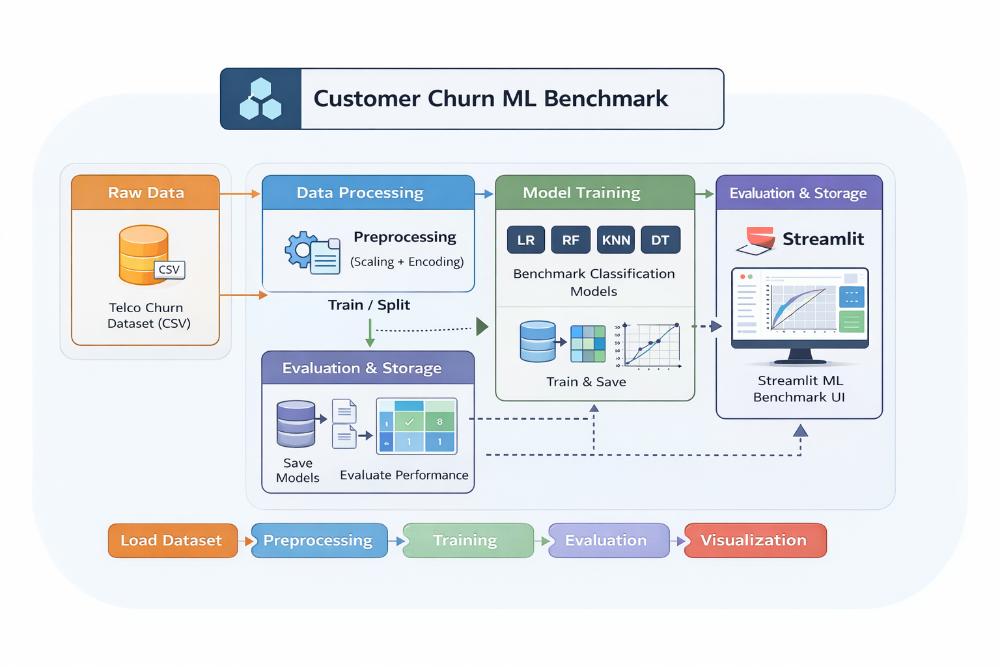

# Customer Churn ML Benchmark (Streamlit)

A **production-style machine learning benchmarking system** for customer churn prediction, combining:

* **Data Science experimentation**
* **Production-ready ML pipeline design**
* **Business-driven churn analytics**

Delivered through an **interactive Streamlit dashboard** with reproducible training, evaluation, and visualization.

---

# 1. Project Purpose

Customer churn is one of the **highest-impact business problems** across:

* Telecommunications
* Banking & FinTech
* SaaS & subscription platforms
* Insurance & utilities

Reducing churn by even **1–2%** can generate **millions in retained revenue**.

This project demonstrates how to design a **real-world churn prediction system** that is:

* **Scientifically valid** (ML benchmarking & metrics)
* **Operationally structured** (clean pipeline & reproducibility)
* **Business meaningful** (actionable churn insights)

---

# 2. Portfolio Positioning

This repository intentionally combines **three professional perspectives**:

## A. Data Science Portfolio Artifact

Shows capability in:

* Data preprocessing & feature handling
* Model experimentation across classical ML algorithms
* Proper evaluation metrics (Accuracy, Precision, Recall, F1, ROC-AUC)
* Confusion matrix & ROC analysis
* Reproducible experimentation pipeline

## B. Production-Style ML System

Demonstrates:

* Modular **src/** architecture
* Train/eval separation
* Model artifact persistence (`.joblib`)
* Deterministic training via random seeds
* CI-ready repository structure
* Streamlit serving layer as lightweight inference UI

## C. Business Churn Analytics Product

Frames ML in **decision-making context**:

* Identifies high-risk customers
* Enables retention targeting
* Supports KPI tracking via ROC-AUC & recall
* Provides interpretable confusion matrices for stakeholders

---

# 3. System Architecture

## Architecture Diagram




## High-Level Flow

```
Raw CSV Dataset
      ↓
Data Loading & Validation
      ↓
Preprocessing Pipeline
 (Scaling + One-Hot Encoding)
      ↓
Model Training (Multiple Algorithms)
      ↓
Evaluation Metrics + ROC + Confusion Matrix
      ↓
Saved Model Artifacts (.joblib)
      ↓
Interactive Streamlit Dashboard
```

## Repository Structure

```
customer-churn-ml-benchmark/
│
├── app/                 # Streamlit dashboard
├── src/churn/           # Core ML pipeline
│   ├── data.py          # Loading & target resolution
│   ├── preprocess.py    # Feature engineering pipeline
│   ├── train.py         # Model training & metrics
│   └── eval.py          # Visualization & summaries
│
├── data/
│   ├── raw/             # Input dataset
│   └── processed/       # Future feature sets
│
├── models/              # Saved trained models
├── reports/             # Future experiment outputs
├── docs/architecture.md # Design documentation
└── README.md
```

---

# 4. Dataset

**Source:** IBM Telco Customer Churn (public benchmark dataset)

### Key Characteristics

| Feature Type | Examples                              |
| ------------ | ------------------------------------- |
| Demographic  | Gender, SeniorCitizen, Dependents     |
| Account      | Tenure, Contract type, Payment method |
| Services     | Internet, Streaming, Tech support     |
| Financial    | MonthlyCharges, TotalCharges          |
| Target       | **Churn (Yes/No)**                    |

### Business Interpretation

* **Short tenure + month-to-month contracts → high churn risk**
* **Higher engagement services → lower churn probability**

---

# 5. Machine Learning Pipeline

## Preprocessing

* Numerical → **StandardScaler**
* Categorical → **OneHotEncoder**
* Combined via **ColumnTransformer**

Ensures:

* No data leakage
* Reproducible feature engineering
* Production-safe transformations

---

## Models Benchmarked

| Model                  | Purpose                     |
| ---------------------- | --------------------------- |
| Logistic Regression    | Interpretable baseline      |
| K-Nearest Neighbors    | Local similarity patterns   |
| Random Forest          | Non-linear ensemble power   |
| Support Vector Machine | Margin-based classification |
| Decision Tree          | Explainable structure       |

---

# 6. Evaluation Framework

## Metrics Used

* **Accuracy** → overall correctness
* **Precision** → false-positive control
* **Recall** → churn detection sensitivity
* **F1 Score** → precision-recall balance
* **ROC-AUC** → ranking quality across thresholds

### Why ROC-AUC Matters

In churn prediction:

> Missing a real churner is **more costly** than a false alarm.
> ROC-AUC measures **ranking ability**, not just classification.

---

# 7. Interactive Dashboard

The Streamlit UI provides:

* Dataset preview
* Adjustable train/test split
* Deterministic retraining
* Model leaderboard
* Confusion matrix visualization
* ROC curve comparison

### Example Workflow

1. Load dataset
2. Click **Train / Re-train models**
3. Inspect leaderboard
4. Analyze confusion matrix
5. Compare ROC curves

---

# 8. Business Insight Example

Typical churn datasets show:

* **Recall is critical** → catching churners early
* Random Forest often balances **precision + recall** best
* Logistic regression provides **interpretability** for policy

This mirrors **real telecom retention analytics**.

---

# 9. How to Run Locally

```bash
python -m venv .venv
.venv\Scripts\activate
pip install -r requirements.txt
streamlit run app/streamlit_app.py
```

Then open:

```
http://localhost:8502
```

---

# 10. Tech Stack

* **Python**
* **Scikit-learn**
* **Pandas / NumPy**
* **Matplotlib**
* **Streamlit**
* **Joblib**
* **GitHub CI-ready structure**

---

# 11. Future Production Extensions

Planned upgrades toward **enterprise ML system**:

* Feature store integration
* Model versioning & registry
* Drift monitoring dashboard
* API inference service (FastAPI)
* Docker deployment
* Cloud hosting (AWS / Azure / GCP)

---

# 12. Professional Value

This project demonstrates capability to:

* Design **end-to-end ML systems**
* Translate **business problems → ML solutions**
* Build **reproducible, production-structured pipelines**
* Deliver **interactive analytics tools**

Aligned with roles such as:

* Data Scientist
* Machine Learning Engineer
* Analytics Engineer
* Applied AI Engineer

---

# Author

**Fahad Amjad**
Master of Data Science & Innovation — UTS
GitHub: https://github.com/fahadamjad009

---
