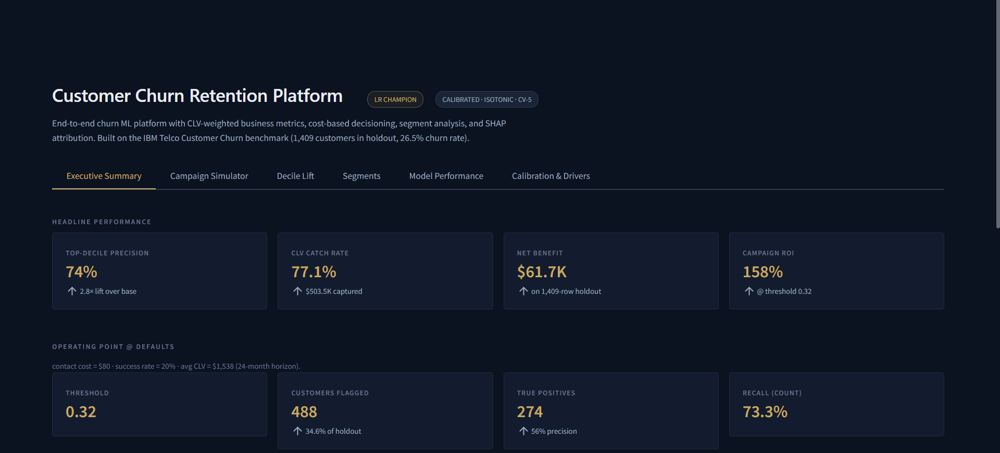
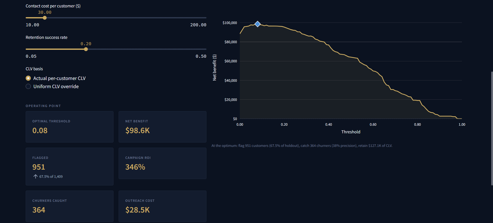
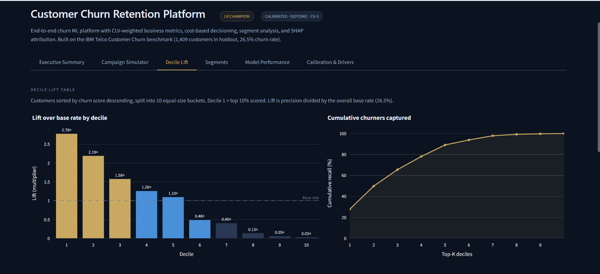
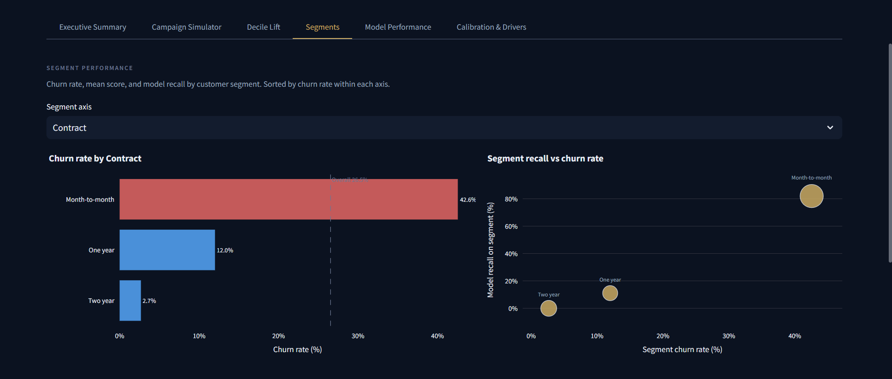
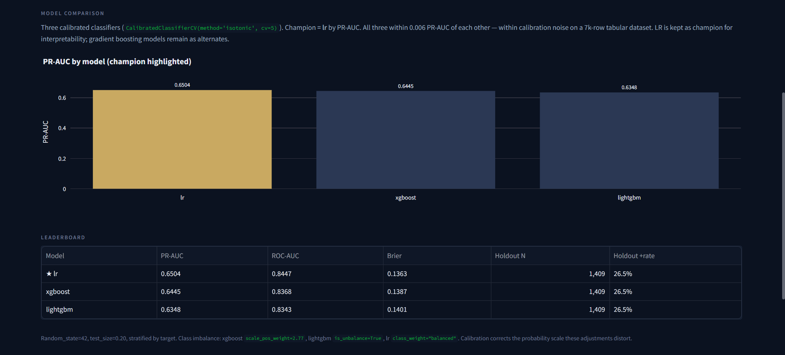
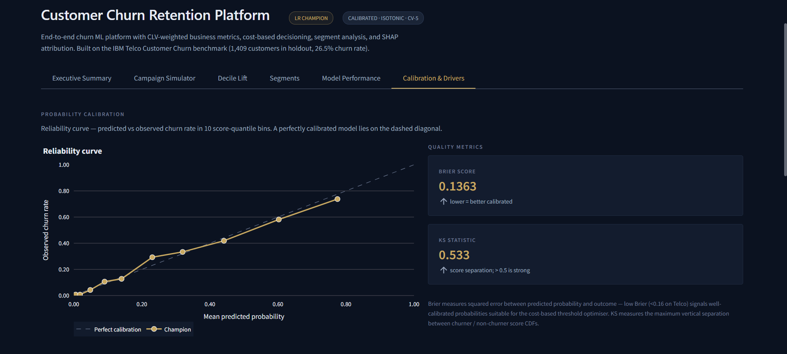
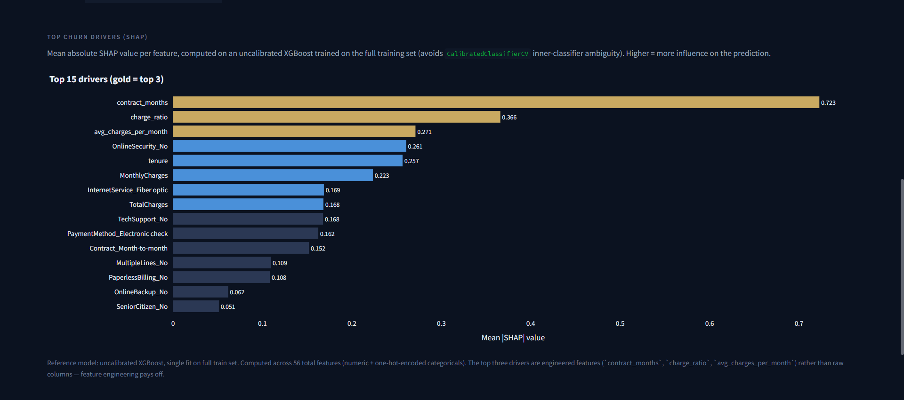
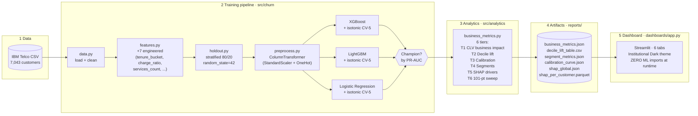

# Customer Churn Retention Platform

[](https://www.python.org/)
[](LICENSE)
[](https://streamlit.io/)
[](https://xgboost.readthedocs.io)
[](https://lightgbm.readthedocs.io)
[](https://shap.readthedocs.io)
[](https://www.kaggle.com/datasets/blastchar/telco-customer-churn)

> **End-to-end churn ML platform with calibrated gradient boosting, CLV-weighted business metrics, segment analytics, SHAP attribution, and an interactive campaign ROI simulator. Built around the cloud-safe pattern — zero ML library calls at dashboard runtime.**

**Live demo →** [customer-churn-benchmark.streamlit.app](https://customer-churn-benchmark.streamlit.app)



---

## Headline numbers

Holdout: **1,409 customers** (20% stratified split, 26.5% churn rate). Champion: calibrated Logistic Regression.

| Metric | Value | What it means |
|---|---|---|
| **Top-decile precision** | **74%** | 2.78× lift over the 26.5% base rate. Top 10% of scored customers contain 74 actual churners per 100. |
| **CLV-weighted catch rate** | **77.1%** | $503,456 of $653,158 at-risk 24-month CLV captured at the optimal threshold. |
| **Net retention benefit** | **$61,651** | Retained value minus outreach cost on the 1,409-row holdout at realistic Telco economics ($80 contact, 20% success, $1,200 avg CLV). |
| **Campaign ROI** | **158%** | Every $1 of contact spend generates $1.58 of net retention benefit. |
| **KS statistic** | **0.533** | Score separation between churners and non-churners. > 0.5 is strong. |
| **Brier score** | **0.1363** | Probability calibration quality. < 0.16 on Telco signals well-calibrated, suitable for cost-based thresholding. |
| **PR-AUC (champion)** | **0.6504** | LR; alternates: XGBoost 0.6445, LightGBM 0.6348. All three within 0.006 — calibration noise on a 7k-row tabular set. |

The **top three SHAP drivers are all engineered features** (`contract_months`, `charge_ratio`, `avg_charges_per_month`) rather than raw columns. Feature engineering pays off.

---

## What this is

A reproducible benchmark + production-style platform for predicting customer churn on the IBM Telco dataset. Three calibrated classifiers (XGBoost, LightGBM, Logistic Regression) compete head-to-head with isotonic-CV calibration; a six-tier business analytics layer turns scores into dollars; and an interactive Streamlit dashboard in the Institutional Dark aesthetic lets a retention manager dial in their economics and see the optimal targeting threshold update live.

Designed to demonstrate end-to-end ML engineering judgement, not just modelling — calibration, cost-based decisioning, CLV-weighted KPIs, segment performance, SHAP attribution, and a cloud-safe runtime architecture.

---

## Why this design

**Calibrated probabilities are non-negotiable.** Every business metric in the dashboard — decile lift, cost-based optimal threshold, campaign ROI, segment recall — is computed against `predict_proba` directly. A model with strong PR-AUC but poor calibration produces meaningless dollar figures. All three classifiers are wrapped in `CalibratedClassifierCV(method="isotonic", cv=5)` and the resulting Brier score (0.1363) is well within the well-calibrated regime for this dataset.

**PR-AUC over ROC-AUC for champion selection.** Telco churn is moderately imbalanced (~26.5% positive). PR-AUC focuses on precision/recall on the positive class — the customers retention teams actually act on — rather than the model's ability to rank pure negatives. ROC-AUC is reported alongside for context.

**Logistic Regression as champion is honest, not a bug.** All three calibrated models land within 0.006 PR-AUC of each other on a 7,043-row tabular dataset — well inside calibration noise. LR wins narrowly and is kept as champion for interpretability; XGBoost and LightGBM remain as alternates in the model comparison view. On a bigger dataset the gradient-boosting models would likely pull ahead.

**Cloud-safe architecture.** The Streamlit dashboard imports zero ML libraries at runtime. All visuals read precomputed artifacts from `reports/` (six JSON / CSV / Parquet files). The Campaign Simulator's live sliders trigger NumPy-only recomputation against a precomputed 101-point threshold sweep, not model inference. This keeps the deployed app fast, light, and impossible to break with a bad slider value.

---

## Dashboard walkthrough

### 1. Executive Summary

Eight metric cards above the fold — top-decile precision, CLV catch rate, net benefit, ROI, plus the operating-point detail (threshold, flagged, true positives, recall). Cumulative gains curve underneath in both count and CLV space, with the random-targeting baseline.


### 2. Campaign Simulator — the differentiator

The retention manager's view. Drag the sliders for contact cost ($10–$200), retention success rate (0.05–0.50), and toggle between actual per-customer CLV vs a uniform override. The optimal threshold marker, net-benefit curve, ROI %, customers flagged, and churners caught all recompute live. Underneath: 101-point precomputed sweep + NumPy-only logic = no model inference per slider change.



> _Example: dropping contact cost from $80 → $30 shifts the optimal threshold from 0.32 → 0.08 and pushes ROI from 158% → 346% (mathematically correct: lower cost makes broader outreach more profitable)._

### 3. Decile Lift

Customers sorted by score descending, split into 10 equal-size buckets. Lift bars (top 3 deciles highlighted), cumulative recall area chart, and a full per-decile detail table showing 74% precision in the top decile.



### 4. Segments

Select a segmentation axis (Contract, tenure bucket, payment method, internet service) and see churn rate by segment value with the overall reference line. Bubble chart of model recall vs segment churn rate makes it clear that Month-to-month customers (42.6% churn) are caught at ~85% recall while two-year-contract customers (2.7% churn) need only sparse coverage.



### 5. Model Performance

Three-way leaderboard with PR-AUC bars (champion highlighted in gold), full numeric leaderboard table, and the class-imbalance handling note. Calibrated probabilities make the head-to-head comparison fair.



### 6. Calibration & Drivers

Reliability curve against the perfect-calibration diagonal — points lying near the dashed line confirm the isotonic calibration is doing its job. Brier and KS metric cards on the right. SHAP top-15 horizontal bar chart underneath, with top 3 in gold (`contract_months`, `charge_ratio`, `avg_charges_per_month`) — note that these are all engineered features rather than raw columns.





---

## Architecture



**The decoupling that makes it work.** `holdout.py` exposes `get_holdout()` and `get_train_and_holdout()` — pure data utilities with no ML dependencies. The training pipeline and the analytics pipeline both call these to reconstruct the same holdout slice without sharing in-memory state. The dashboard imports neither training nor analytics modules; it reads JSON / CSV / Parquet from disk and renders Plotly. This means the deployed Streamlit Cloud app needs no model files at serve time, just the small set of report artifacts.

---

## Run locally

PowerShell (Windows) — substitute `source .venv/bin/activate` on macOS/Linux.

```powershell
# Clone
git clone https://github.com/fahadamjad009/customer-churn-ml-benchmark.git
cd customer-churn-ml-benchmark

# Set up Python 3.11 virtual env
python -m venv .venv
.venv\Scripts\activate

# Install pinned deps (incl. xgboost / lightgbm / shap for training; streamlit/plotly for the dashboard)
pip install -r requirements.txt

# Install the local package in editable mode so `churn` and `analytics` are importable
pip install -e .

# Train all three calibrated models (~5–10 min wall time)
python -m churn.train

# Run the six-tier analytics layer (~2–3 min, mostly the SHAP reference XGBoost fit)
python -m analytics.business_metrics

# Launch the dashboard
streamlit run dashboards/app.py
```

The dashboard opens at `http://localhost:8501`.

---

## Repository structure

```
customer-churn-ml-benchmark/
├── .streamlit/
│   └── config.toml                       # Institutional Dark theme
├── dashboards/
│   └── app.py                            # Streamlit dashboard (1,039 lines, 6 tabs)
├── data/raw/
│   └── churn.csv                         # IBM Telco benchmark (7,043 rows)
├── docs/
│   ├── architecture.md
│   └── screenshots/                      # Dashboard captures
├── models/
│   ├── champion.joblib                   # (gitignored, regenerable in <10 min)
│   ├── xgboost.joblib                    # (gitignored)
│   ├── lightgbm.joblib                   # (gitignored)
│   ├── lr.joblib                         # (gitignored)
│   └── leaderboard.json                  # Model comparison summary
├── reports/
│   ├── business_metrics.json             # Master, includes 101-pt threshold sweep
│   ├── decile_lift_table.csv
│   ├── segment_metrics.json
│   ├── calibration_curve.json
│   ├── shap_global.json
│   └── shap_per_customer.parquet
├── src/
│   ├── analytics/
│   │   ├── __init__.py
│   │   └── business_metrics.py           # 6-tier analytics layer
│   └── churn/
│       ├── __init__.py
│       ├── data.py                       # Load + clean + stratified split
│       ├── features.py                   # 7 engineered features
│       ├── preprocess.py                 # ColumnTransformer (leak-safe)
│       ├── holdout.py                    # Independent holdout reconstruction utility
│       └── train.py                      # 3-model training pipeline
├── .env.example
├── .gitignore
├── LICENSE                               # MIT 2026 Fahad Amjad
├── pyproject.toml                        # PEP 621 metadata
├── README.md
├── requirements.txt                      # Pinned consultant-tier deps
└── runtime.txt                           # python-3.11 (for Streamlit Cloud)
```

---

## Tech stack

| Layer | Library | Why |
|---|---|---|
| **Modelling** | `xgboost 2.1.3`, `lightgbm 4.5.0` | Industry-standard gradient boosting for tabular churn. |
| **Calibration** | `scikit-learn 1.5.2` (`CalibratedClassifierCV`) | Isotonic, 5-fold CV. Corrects the probability scale that `scale_pos_weight` / `class_weight` distort. |
| **Baseline** | `scikit-learn` (`LogisticRegression`) | Interpretable champion; coefficients tell the story when boosters need a deeper dive. |
| **Attribution** | `shap 0.46.0` (`TreeExplainer`) | Global + per-customer feature attribution on an uncalibrated XGBoost reference model. |
| **Analytics** | `numpy 1.26`, `pandas 2.2`, `pyarrow 18.1` | The whole 6-tier computation. Parquet for the SHAP per-customer matrix. |
| **Dashboard** | `streamlit 1.40.2`, `plotly 5.24.1` | Single-file app with custom CSS + Plotly `institutional` theme. Cloud-safe (no ML at runtime). |
| **Persistence** | `joblib 1.4.2` | Model serialisation. |

---

## Honest limitations

These are real and worth knowing:

- **Benchmark dataset.** IBM Telco is a public 7,043-row research benchmark, not real-world production data. Patterns that survive on Telco often generalise, but production scale (10⁵–10⁶ customers) would change a lot: gradient boosting would likely pull ahead of LR, hyperparameter search would be worth more, drift monitoring would matter.
- **CLV is a simple heuristic.** `MonthlyCharges × 24` (24-month forward CLV). A stronger version would fit a survival curve (e.g. Kaplan-Meier on tenure × Churn with `lifelines`) and use expected remaining months. The heuristic is good enough for the business-metrics math to be meaningful but doesn't reflect customer-level CLV variance from tenure or segment.
- **Retention success rate is assumed, not measured.** 20% is the industry-standard mid-range for proactive retention but in a real deployment you would A/B test the intervention and update this from observed treated-vs-control outcomes.
- **SHAP computed on uncalibrated XGBoost, not on the calibrated LR champion.** `CalibratedClassifierCV` produces five inner classifiers (one per CV fold); SHAP on the ensemble is ambiguous. A separate uncalibrated XGBoost trained on the full training set gives stable per-customer attributions; PR-AUC is comparable to the calibrated XGBoost (within 0.005). Trade-off documented in `src/analytics/business_metrics.py`.
- **Calibration set = holdout set.** With 7,043 rows there's no separate calibration partition, so the Brier / reliability curve is reported on the same 20% holdout used to score business metrics. A bigger dataset would warrant a three-way split (train / cal / test).
- **No production drift monitoring.** Out of scope for a benchmark project. The fintech-fraud-detection-platform sister repo demonstrates PSI/KS drift monitoring for production deployments.

---

## License

[MIT](LICENSE) © 2026 Fahad Amjad

---

<sub>Part of a six-project portfolio demonstrating end-to-end ML engineering across FinTech and RegTech. See also: [fintech-fraud-detection-platform](https://github.com/fahadamjad009/fintech-fraud-detection-platform), [mining-operations-analytics-platform](https://github.com/fahadamjad009/mining-operations-analytics-platform), [asx-abs-early-warning](https://github.com/fahadamjad009/asx-abs-early-warning).</sub>
